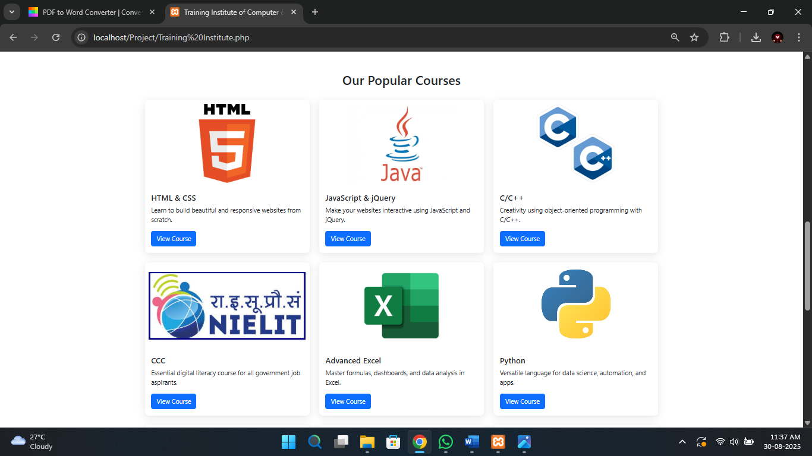
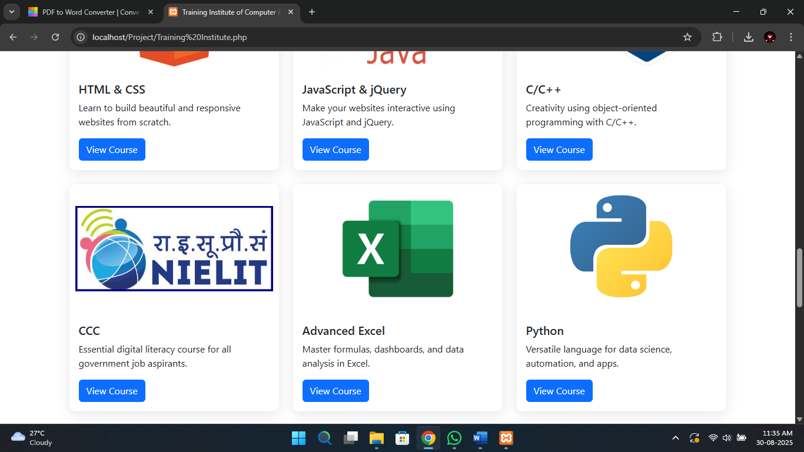
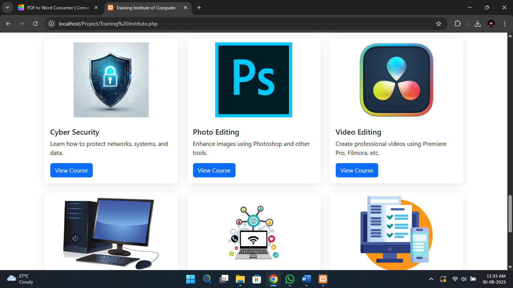
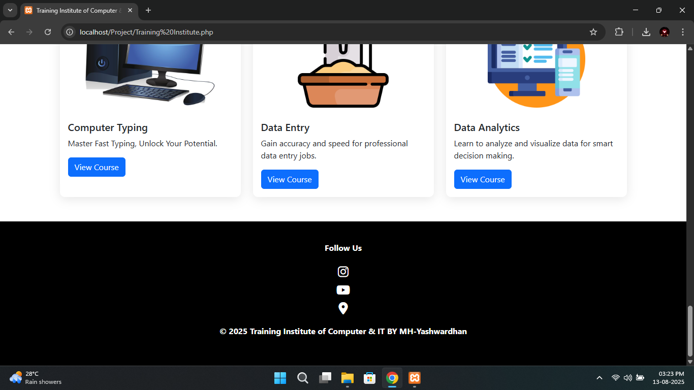

# Training Institute Management System

A full-stack web-based Training Institute Management System developed using PHP, MySQL, JavaScript, Bootstrap 5, and AdminLTE Dashboard during a 3-month Full Stack Web Development Internship as part of the Diploma in Computer Engineering curriculum.

The system includes both an Admin Panel for managing institute operations and a Public Website Interface for displaying courses, institute information, and student interaction features.

🌐 Live Demo:
https://skillforgeinstitute.42web.io
---

## Features

* Admin dashboard with analytics view
* Student registration management
* Trainer management system
* Course & batch management
* Attendance tracking system
* Payment tracking system
* Enquiry management module
* Expense tracking module
* Secure login system
* Database export included (.sql file)

---

## Technologies Used

### Frontend

* HTML
* CSS
* Bootstrap 5
* JavaScript
* AdminLTE Dashboard Template

### Backend

* PHP

### Database

* MySQL

### Tools

* XAMPP
* phpMyAdmin
* Git & GitHub

---

## Database Setup

Create database in phpMyAdmin:

```
mh_yashwardhan_institute
```

Import file:

```
mh_yashwardhan_institute.sql
```

Run project using XAMPP (Apache + MySQL enabled)

---

## Modules Included

* Admin Management
* Student Management
* Trainer Management
* Course Management
* Batch Management
* Attendance Tracking
* Payment Records
* Expense Tracking
* Enquiry Records

---

## Project Purpose

This project was developed during a **3-month Full Stack Web Development Internship** to demonstrate practical implementation of:

* CRUD operations
* Database connectivity
* Admin dashboard integration
* Multi-module system development
* Real-world training institute workflow automation

---

## Public Website Interface

### Homepage


### Institute Gallery


## Courses Offered

### Programming Courses



### Certification & Office Courses



### Additional Technical Courses



### Multimedia & Security Courses



## Installation & Setup

1. Clone the repository

```
git clone https://github.com/yashbandawane04/training_institute_management_system.git
```

2. Move project folder to XAMPP htdocs directory

```
C:\xampp\htdocs\
```

3. Import the database

Open **phpMyAdmin**

Create database:

```
mh_yashwardhan_institute
```

Import:

```
mh_yashwardhan_institute.sql
```

4. Start Apache and MySQL from XAMPP

5. Open browser and run:

```
http://localhost/training_institute_management_system
```

## Author

**Yash Bandawane**

Diploma in Computer Engineering
(Completed – Result Awaited)

GitHub:
https://github.com/yashbandawane04
